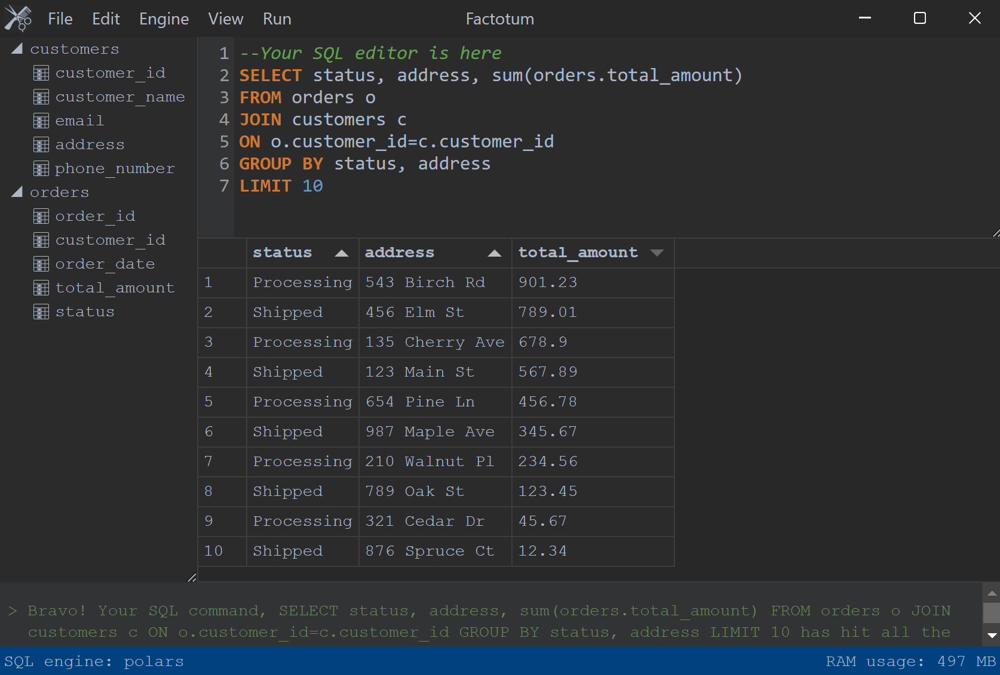

# Factotum

Factotum is a simple app designed to make it easier to work with a variety of data file formats. Import your data files as tables into a temporary database and use the full power of SQL.



## Technical Overview

Factotum is built on the Electron framework, with a Python server running in the background. All client-server communications occur over HTTP.

## Supported File Formats

Factotum provides compatibility with the following data file formats:

- **Comma Separated Values (CSV):** `.csv`
- **Tab Separated Values (TSV):** `.tsv`
- **Microsoft Excel:** `.xls`, `.xlsx`, `.xlsm`, `.xlsb`
- **OpenOffice Formats:** `.odf`, `.ods`, `.odt`
- **Apache Parquet:** `.parquet`
- **Apache AVRO:** `.avro`
- **Apache ORC:** `.orc`
- **JavaScript Object Notation (JSON):** `.json`
- **Feather Binary Format:** `.feather`
- **Statistical Analysis System (SAS):** `.sas7bdat`, `.xpt`
- **Extensible Markup Language (XML):** `.xml`
- **Statistical Package for the Social Sciences (SPSS):** `.sav`
- **Stata Data Format:** `.dta`
- **Hierarchical Data Format (HDF):** `.h5`, `.hdf5`

## SQL Engines

Factotum utilizes the following SQL engines for data processing:

- **Polars:** A DataFrame library implemented in Rust.
- **DuckDB:** An in-memory analytical database written in C++.

## Setting Up Locally

To get started with Factotum in a development environment, follow these steps:

### 1. Install Node Dependencies:

```
yarn
```

### 2. Install Python Dependencies:

```
npm run setup-micromamba
npm run setup-venv
```

### 3. Build Python Server:

```
npm run build-server
```

### 4. Start Factotum:

```
npm start
```
